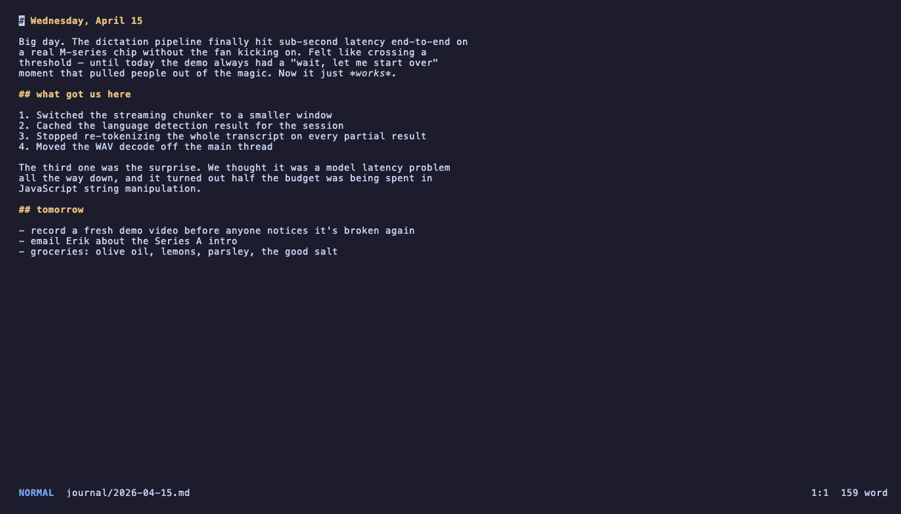
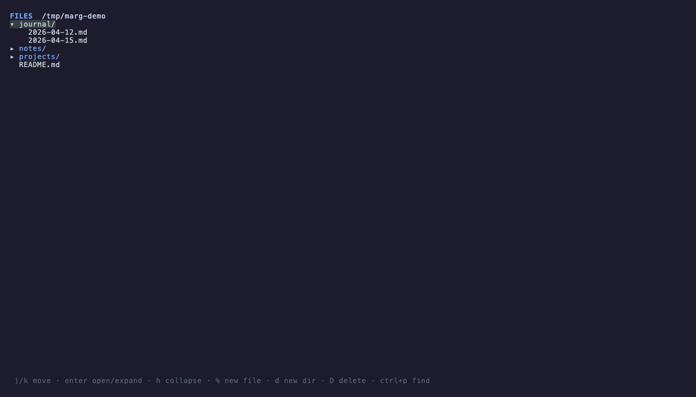
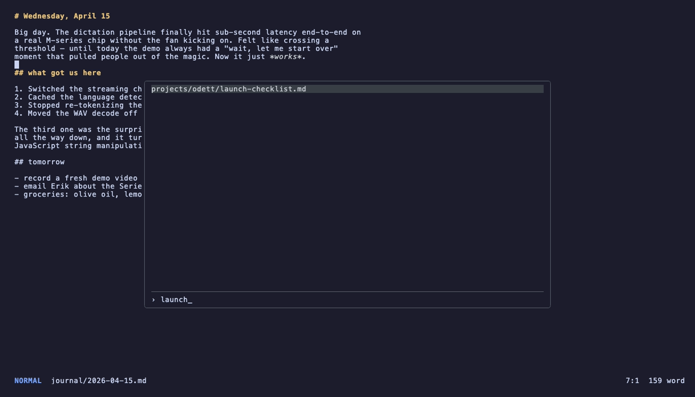
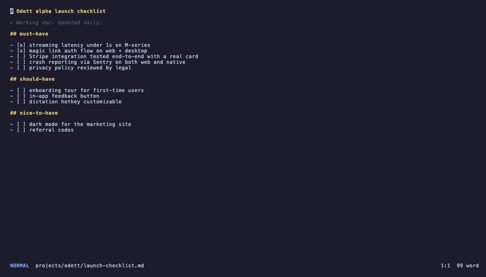
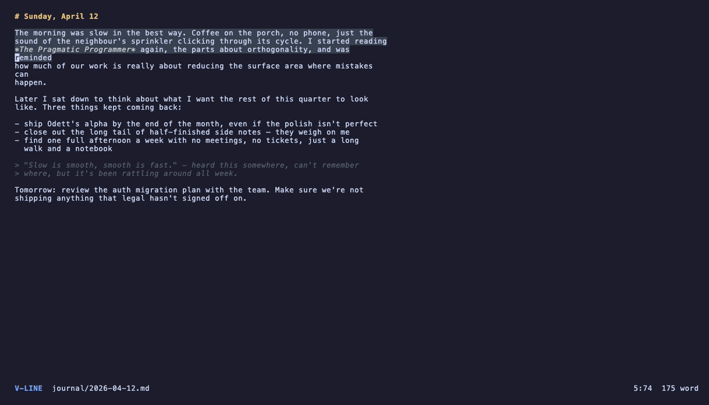
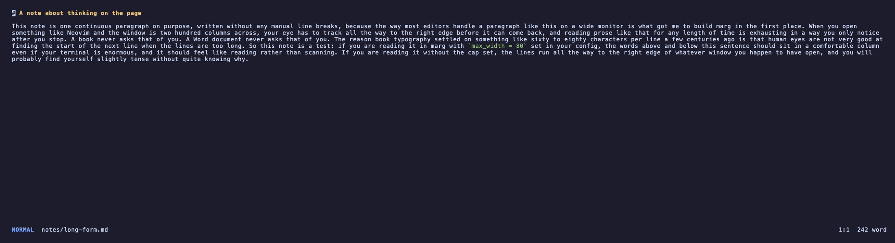

# marg

A terminal markdown editor. Word-doc feel, vim keys, no forever-long lines.

> Codename — eventual product name TBD.

<p align="center">
  
</p>

## why

Most of my work lives in the terminal these days. Neovim is great for code, less great for prose: lines run to the horizon, no obvious file picker for "all my notes", no easy "browse folder of markdown" entry point. marg is a small, focused TUI that does just that:

- soft-wrap that stops at the edge of your terminal — paragraphs read like a Word doc
- vim keybindings (or arrow keys, both work)
- VS Code-style fuzzy file picker (`ctrl+p`)
- netrw-style file tree (`:Ex`) — markdown-only, recursive
- pipe-friendly: `odett ... | marg` works (planned)

## install

```bash
cd marg
go build -o marg .
mv marg ~/.local/bin/   # or anywhere on $PATH
```

Requires Go 1.24+.

## usage

```bash
marg                  # open the file tree on the current directory
marg .                # same
marg path/to/dir      # open the file tree on that directory
marg path/to/file.md  # open that file directly
```

### file tree

`marg` (or `marg .`) drops you straight into a recursive markdown-only tree. Folders without any `.md` files don't show up — your notes vault is the whole tree, the build artifacts and config files don't get in the way.

<p align="center">
  
</p>

### fuzzy file picker (`ctrl+p`)

`ctrl+p` from anywhere opens a centered overlay. Type to filter, up/down to navigate, enter to open, esc to cancel. Subsequence match (so `oroad` finds `odett/roadmap.md`).

<p align="center">
  
</p>

### markdown styling

Headings, blockquotes, sub-headings, bullet lists, **bold**, *italic*, `inline code`, and [links](https://example.com) are all styled inline as you type — soft-wrapped like a Word document, no line numbers, nothing in your way.

<p align="center">
  
</p>

### visual selection

`v` for character selection, `V` for line selection. Extend with any motion, then `y` to yank, `d`/`x` to cut, `p` to replace.

<p align="center">
  
</p>

## keybindings

### everywhere

| key      | action                       |
|----------|------------------------------|
| `ctrl+p` | fuzzy file picker            |
| `ctrl+e` | toggle file tree             |

### editor — normal mode

| key            | action                                |
|----------------|---------------------------------------|
| `h j k l` / arrows | move cursor (j/k = visual line)   |
| `0` / `home`   | start of line                         |
| `_` / `^`      | first non-blank character             |
| `$` / `end`    | end of line                           |
| `gg`           | top of buffer                         |
| `G`            | bottom of buffer                      |
| `w` / `b`      | word forward / backward               |
| `ctrl+d` / `ctrl+u` | jump half page down / up         |
| `ctrl+f` / `ctrl+b` | jump full page down / up         |
| `i` / `a`      | insert before / after cursor          |
| `I` / `A`      | insert at line start / end            |
| `o` / `O`      | open new line below / above           |
| `x`            | delete char under cursor              |
| `dd`           | cut (delete) current line             |
| `yy` / `Y`     | yank (copy) current line              |
| `p` / `P`      | paste after / before cursor (or below/above for line-wise) |
| `v` / `V`      | visual / visual-line selection mode   |
| `:`            | command line (`:w`, `:q`, `:wq`, `:Ex`) |
| `ctrl+s`       | save                                  |

### editor — visual mode (`v` / `V`)

Move with motions to extend the selection. Then:

| key            | action                                |
|----------------|---------------------------------------|
| `y`            | yank selection                        |
| `d` / `x`      | cut selection                         |
| `p`            | replace selection with register       |
| `esc`          | leave visual mode                     |

### editor — insert mode

Type freely. Arrow keys, backspace, delete, enter, tab all behave naturally.
`esc` returns to normal mode.

### file tree (`:Ex`)

| key            | action                                |
|----------------|---------------------------------------|
| `j k` / arrows | move cursor                           |
| `enter` / `l`  | open file or expand folder            |
| `h`            | collapse folder / jump to parent      |
| `g` / `G`      | top / bottom                          |
| `%`            | new file (creates `.md` if no ext)    |
| `d`            | new directory                         |
| `D`            | delete (with confirmation)            |
| `R`            | refresh                               |
| `esc` / `q`    | back to editor (or quit if no file)   |

### file picker (`ctrl+p`)

Type to filter (subsequence match). Up/down to navigate. Enter to open. Esc to cancel.

## config

Optional config at `~/.config/marg/config.toml`. Format is `key = value` per line, `#` for comments.

```toml
# Cap the wrap width below the terminal width — useful in wide terminals
# where prose otherwise stretches out into a horizontal blur.
max_width = 80
```

### `max_width` in action

A wide terminal without `max_width` lets a single paragraph spread across the whole screen — readable in theory, exhausting in practice.

<p align="center">
  
  <br/>
  <i>Without <code>max_width</code> — text fills the entire terminal width.</i>
</p>

The same paragraph with `max_width = 80` stays at a comfortable book-page column even on a huge monitor.

<p align="center">
  
  <br/>
  <i>With <code>max_width = 80</code> — text held at a comfortable reading width.</i>
</p>

## regenerating the screenshots

The screenshots above are generated from a [VHS](https://github.com/charmbracelet/vhs) tape and a throwaway notes vault.

```bash
brew install vhs            # one-time
bash demo/setup.sh          # builds /tmp/marg-demo
vhs demo/tape/main.tape     # main screenshot set
vhs demo/tape/wrap.tape     # max_width comparison
```

PNGs land in `assets/screenshots/`.

## status

v1 — works for me. Lots to add (undo, find/replace, list helpers, dictation pipe).
